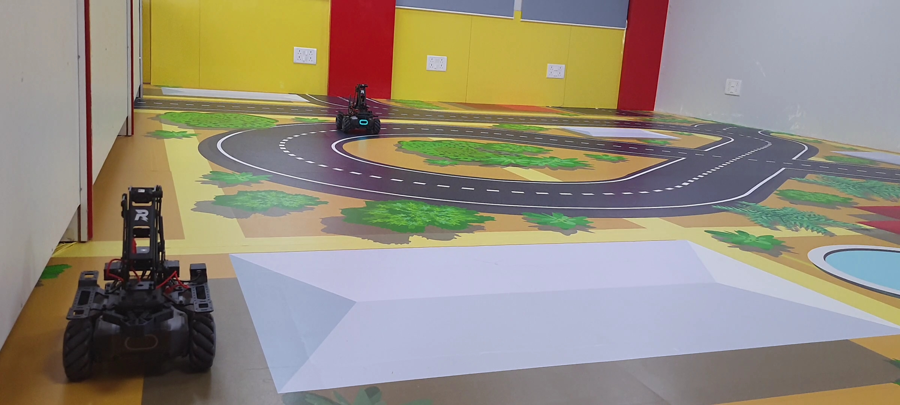
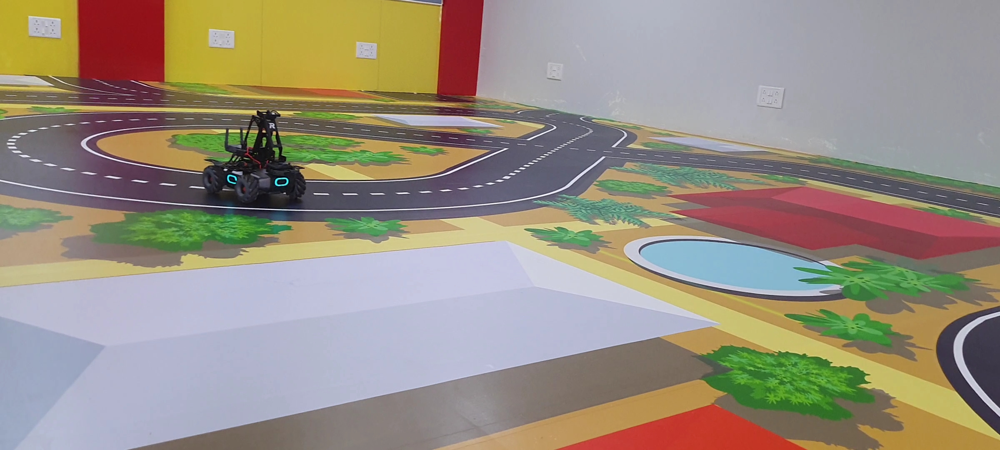
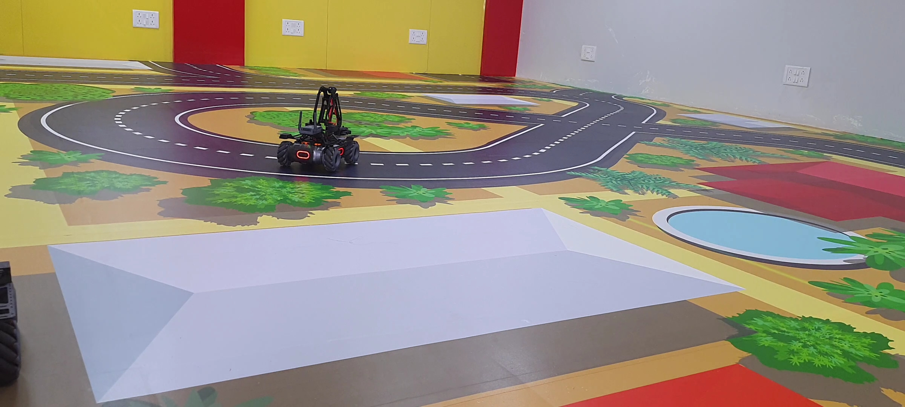
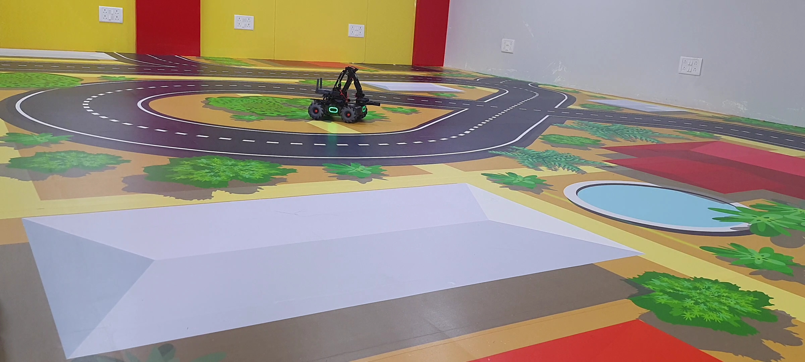

# MobileRobot-Openloopcontrol
## Aim:

To develop a python control code to move the mobilerobot along the predefined path.

## Equipments Required:
1. RoboMaster EP core
2. Python 3.7

## Procedure

### Step1:

Use from robomaster import robot

### Step2:

Choose the x,y,z - axis movement distance(meters).

### Step3:

Give ep_chasis.move to move straight

### Step4:

Give ep_chasis.drive to get circular motion.

### Step5:

Give ep_chasis.move to move straight

### Step 6:

Give ep_chasis.drive to get circular motion.

## Program
```python
from robomaster import robot
import time
from robomaster import camera

if _name_ == '_main_':
    ep_robot = robot.Robot()
    ep_robot.initialize(conn_type="ap")

    ep_chassis = ep_robot.chassis
    ep_led = ep_robot.led

    '''
    x = x-axis movement distance,( meters) [-5,5]
    y = y-axis movement distance,( meters) [-5,5]
    z = rotation about z axis ( degree)[-180,180]
    xy_speed = xy axis movement speed,( unit meter/second) [0.5,2]
    '''
    ep_camera = ep_robot.camera

    print("Camera streaming started...")
    ep_camera.start_video_stream(display=True, resolution=camera.STREAM_360P)    

    ep_chassis.move(x=2, y=0, z=0, xy_speed=0.75).wait_for_completed()

    ep_chassis.drive_speed(x=0.2,y=0,z=-20)
    time.sleep(8)

    ep_led.set_led(comp="all",r=0,g=255,b=0,effect="on")
    time.sleep(2)

    ep_chassis.move(x=1.5, y=0, z=0, xy_speed=0.75).wait_for_completed()

    ep_chassis.drive_speed(x=0.2,y=0,z=20)
    time.sleep(8)

    ep_led.set_led(comp="all",r=0,g=0,b=255,effect="on")
    time.sleep(2)     

    ep_chassis.move(x=1.5, y=0, z=0, xy_speed=0.75).wait_for_completed()

    ep_camera.stop_video_stream()
    print("Stopped video streaming...")


    ep_robot.close()
```

## MobileRobot Movement Image:


Insert image here









## MobileRobot Movement Video:


https://youtu.be/OiA1k4OikBI


## Result:
Thus the python program code is developed to move the mobilerobot in the predefined path.


<br/>
<br/>

```
Mobile Robotics Laboratory
Department of Artificial Intelligence and Data Science/ Machine Learning
Saveetha Engineering College
```
